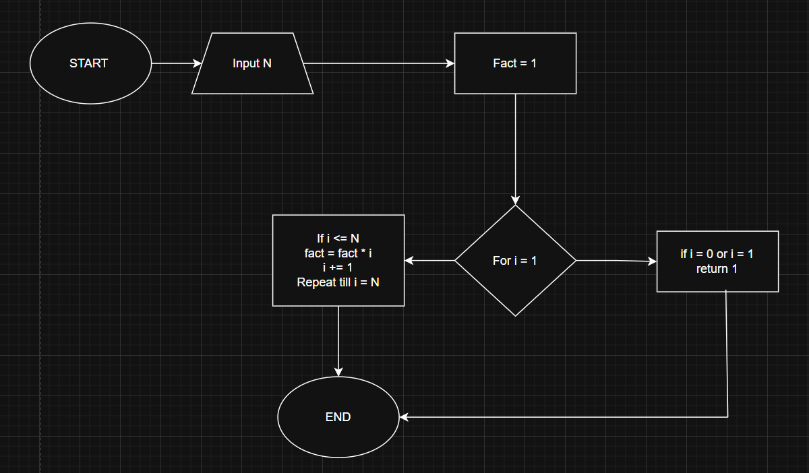
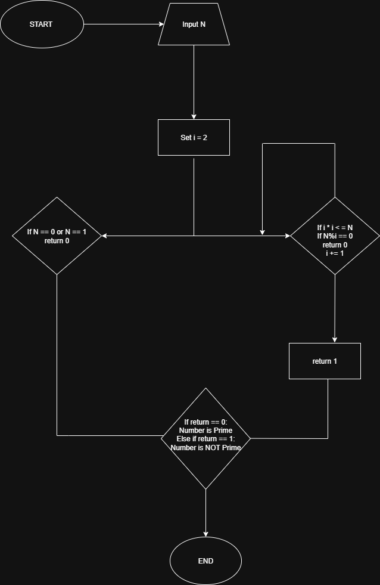

# Problem 1: Basic
Calculate the factorial of a number  
Input: A positive integer N   
Output: N! (N factorial)

### Algorithm:
1. START.
2. Input N.
3. Set Fact = 1
4. Repeat for i from 1 to N:
    fact = fact * i
5. After loop ends, fact will hold the required factorial of N.
6. Output fact
7. End

### Pseudocode:

    BEGIN Factorial
        Input N
        Set fact to 1
        For i = 1, if i <= N, Do 
              fact = fact * i
              i = i + 1
        End For
        Output "Factorial is" : Fact
    End Factorial

### Flowchart :

---

# Problem 2: Intermediate
Check if a number is prime   
Input: A positive integer N   
Output: "Prime" or "Not Prime"

### Algorithm:
1. START.
2. Input N.
3. Set i = 2.
4. If N == 0 or N == 1, return 0.
5. Repeat for i * i <= N:
        if n % i == 0, return 0
        i += 1
6. If loop finishes, return 1.
7. If return == 1, num is prime. Else if return == 0, not prime.
8. END

### Pseudocode: 
    BEGIN CHECKPRIME
            Input N
            Set i to 2
            If N == 0 or N == 1:
                    return 0
            For i * i <= n,
                If N % i == 0, return 0
                    i += 1
            End For
            return 1
            Output 
                If return == 1: "Num is prime"
                Else: "Num is not prime"
    End CHECKPRIME

### Flowchart: 

---
    
# Problem 3: Advanced
Sort an array using bubble sort   
Input: Array of integers   
Output: Sorted array in ascending order

### Algorithm: 
1. START
2. Input an array A of size N.
3. Repeat for pass = 1, N - 1 times.
4. For i = 0, if A[i] > A[i+1], Swap A[i] and A[i+1]. Else, continue. Increment i by 1.
5. After the loop finishes, the array is sorted in ascending order.
6. Output Array.
7. END

### Pseudocode:
    BEGIN BUBBLESORT
        Input Array
        Set Size of array = N
        Set i = 0
        Set temp = 0
        For pass = 1, till N - 1, 
                    If A[i] > A[i+1]:
                        temp = A[i]
                        A[i] = A[i+1]
                        A[i+1] = temp
                        i += 1
        End For
        Print Array
    END BUBBLESORT

### Flowchart: 

